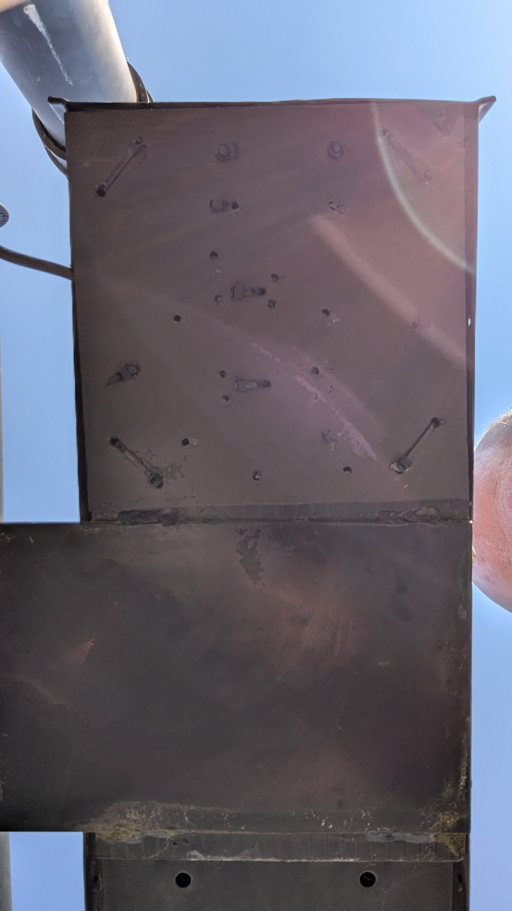
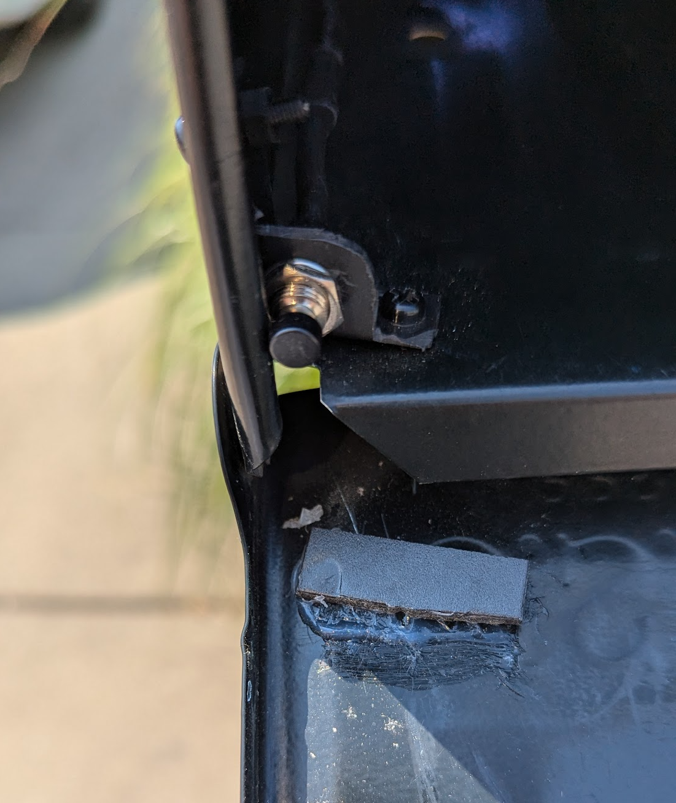

# mailbox-esp32-push-button-sensor
use micropython on an esp32 to sense (snail) mailbox door status 

# Mailbox Monitoring System Documentation

## 1. Introduction

- **Project Overview**
  This project provides a robust system for monitoring and managing the state of a physical mailbox. By integrating the
  ESP32 with AWS services, it ensures that mailbox events are tracked and notified reliably. The state machine and
  health check mechanisms add layers of fault tolerance and alerting, making the system resilient and responsive to
  changes in the mailbox's state.

- **Objectives**
  The primary objective of this project is to develop a reliable and efficient system for monitoring the state of a
  physical mailbox. The system aims to provide real-time notifications and updates on the mailbox status (open, closed,
  or ajar) by leveraging an ESP32 microcontroller and AWS cloud services.

## 2. Hardware Components

- **ESP32-WROOM-32D Microcontroller**
    - Specifications
        - **Processor**: Dual-core Xtensa® 32-bit LX6 microprocessor, up to 240 MHz
        - **Memory**:
            - 448 KB ROM
            - 520 KB SRAM
            - 16 KB SRAM in RTC
        - **Flash**: 4 MB embedded SPI flash
        - **Operating Voltage**: 2.2V to 3.6V
        - **Power Consumption**:
            - Active mode: 160-240 mA
            - Deep sleep mode: 10 µA
            - Power down mode: 5 µA
        - **Wireless Connectivity**:
            - **Wi-Fi**: 802.11 b/g/n, supports WPA/WPA2/WPA 3 (NOTE: 2.4GHz ONLY)
            - **Bluetooth**: v4.2 BR/EDR and BLE (Bluetooth Low Energy)
- **Mini Push-Button Sensor**
    - Specifications
        - Total length: Approx. 27mm / 1.06 inch
        - Name:7mm Prewired Momentary Push Button
        - Action Type: Momentary
        - Rating Voltage: 3V-6V-12V-24V-230V/1A
- **LED Indicator**
    - Specifications
        - Lens: 10mm Diameter / Frosted / Round
        - Emitting Color: RGB (Common Cathode)
        - Luminous Intensity: R:1000-2000mcd G:4000-5000mcd B:3000-4000mcd
        - Viewing Angle: 120 Degree
        - Forward Voltage / Current: R:2V-2.2V G:3V-3.2V B:3V-3.2V | 20mA (each color)
- **Power Supply**
    - Specifications
        - Input: 100~240V AC, 50/60Hz
        - Output voltage: 12V DC
        - Output current: 3A max
        - Output wattage: 36W max
- **DC Converter**
    - Specifications
        - Input voltage: DC12V/9V (6.3V-22V)
        - Output voltage: DC5V
        - Output Current: 3A
        - Output Power: 15W

## 3. Hardware Parts List

- **ESP32 Development Board**
- **Button Sensor (e.g., tactile button)**
- **LED (any color)**
- **Breadboard and Jumper Wires**
- **Power Supply (e.g., USB power adapter)**
- **Enclosure for ESP32 (optional, for protection)**
- **Mounting Tape or Screws (for securing components in the mailbox)**

## 4. Hardware Assembly

- **Wiring Diagram**
- **Assembly Instructions**
- **Installation in Mailbox**
    - Placement of ESP32
    - Placement of Button Sensor
    - Placement of LED Indicator

## 5. ESP32 Firmware

- **Overview**
    - Purpose
    - Features
- **Code Structure**
    - Main Functions
    - Libraries Used
- **Wi-Fi Connectivity**
    - Configuration Instructions
    - Troubleshooting
- **State Detection Logic**
    - Button Press Detection
    - State Transitions
- **HTTP POST Requests**
    - Endpoint Configuration
    - Payload Structure
- **LED Indicator Logic**
    - State Indications

## 6. AWS Lambda Functions

- **Overview**
    - Purpose
    - Features
- **State Management Lambda**
    - Function Logic
    - Event Handling
    - DynamoDB Integration
    - SNS Notifications
- **Health Check Lambda**
    - Function Logic
    - Timestamp Verification
    - Alerting Mechanism

## 7. Mailbox State Machine

- **State Diagram**
- **State Definitions**
    - OPEN
    - CLOSED
    - AJAR
- **State Transitions**
    - Transition Conditions
- **DynamoDB Schema**
    - Table Structure
    - Attributes

## 8. AWS Services Integration

- **DynamoDB**
    - Table Configuration
    - Data Storage Logic
- **SNS (Simple Notification Service)**
    - Notification Configuration
    - Alerting Logic

## 9. System Deployment

- **ESP32 Firmware Upload**
    - Tools Required
    - Step-by-Step Instructions
- **AWS Lambda Deployment**
    - Function Configuration
    - Deployment Steps
- **DynamoDB Setup**
    - Table Creation
    - Configuration Steps
- **SNS Setup**
    - Topic Creation
    - Subscription Configuration

## 10. Testing and Validation

- **ESP32 Testing**
    - Connectivity Test
    - State Detection Test
- **Lambda Functions Testing**
    - State Management Test
    - Health Check Test
- **End-to-End System Test**
    - Test Scenarios
    - Expected Outcomes

## 11. Troubleshooting

- **Common Issues**
- **Diagnostic Steps**
- **Solutions**

## 12. Maintenance

- **Regular Checks**
- **Firmware Updates**
- **AWS Services Monitoring**

## 13. Appendices

- **Code Listings**
- **Circuit Diagrams**
- **Configuration Files**
- **References**

